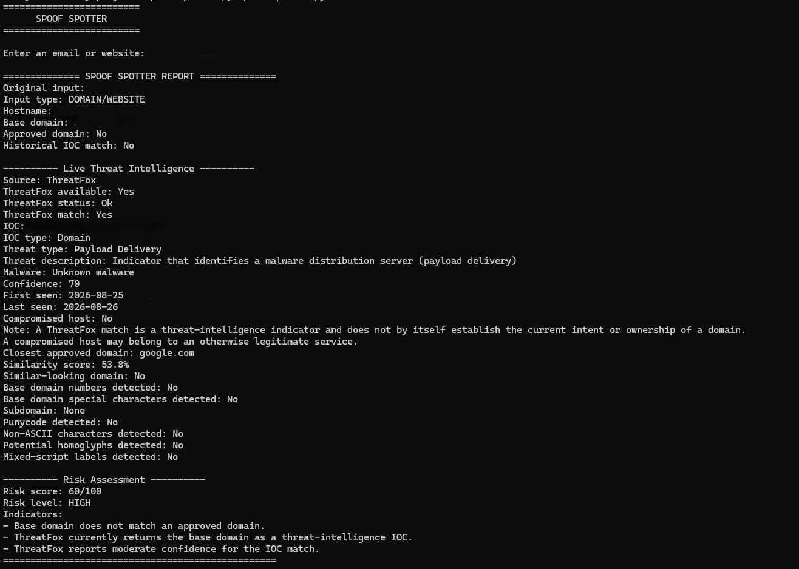

# Spoof Spotter

Spoof Spotter is a Python-based domain and email analysis tool designed to identify indicators commonly associated with spoofing, phishing, and malicious domain activity.

The project combines local domain analysis with historical and live threat intelligence to produce an explainable heuristic risk score.

> **Important:** Spoof Spotter is an educational cybersecurity project. Risk scores represent weighted security indicators and are **not** probabilities that a domain is malicious.

---

## Getting Started

### 1. Clone the Repository

Clone or download the Spoof Spotter repository and open a terminal in the project directory.

### 2. Install Dependencies

```cmd
py -m pip install -r requirements.txt
```

### 3. Configure ThreatFox (Optional)

Spoof Spotter supports live threat-intelligence lookups through the ThreatFox Community API by abuse.ch.

ThreatFox integration is optional. If no Auth-Key is configured, Spoof Spotter will continue using its local analysis and historical IOC intelligence.

To enable ThreatFox:

1. Visit the [abuse.ch Authentication Portal](https://auth.abuse.ch/).
2. Sign in or create an abuse.ch profile.
3. Generate your personal Auth-Key.
4. Keep the Auth-Key private and never commit it to GitHub.
5. Store the key in the `THREATFOX_AUTH_KEY` environment variable.

For a temporary Windows CMD session:

```cmd
set THREATFOX_AUTH_KEY=YOUR_AUTH_KEY
```

Verify that Spoof Spotter can detect the key without displaying it:

```cmd
py -c "from core.threatfox import get_auth_key; print('ThreatFox key loaded:', bool(get_auth_key()))"
```

Expected result:

```text
ThreatFox key loaded: True
```

When finished, remove the key from the current CMD session:

```cmd
set THREATFOX_AUTH_KEY=
```

ThreatFox API documentation:

- [ThreatFox API Documentation](https://threatfox.abuse.ch/api/)

### 4. Run Spoof Spotter

```cmd
py spoof_spotter.py
```

Enter an email address, domain, or website when prompted.

### 5. Run the Automated Test Suite

```cmd
py -m unittest discover -s tests -v
```

The ThreatFox unit tests use mocked API responses and do not require a real Auth-Key or contact the live ThreatFox service.

---

## Current Features

### Input Analysis

- Accepts domain names, websites, and email addresses
- Normalizes domain input
- Extracts base domains and subdomains
- Supports multi-level public suffixes

### Domain Analysis

- Approved-domain checking
- Similarity and typo-squatting detection
- ASCII digit detection
- Domain and subdomain character analysis
- Unicode character detection
- Homoglyph detection
- Mixed-script detection
- Punycode detection and decoding

### Historical Threat Intelligence

Spoof Spotter supports historical IOC correlation using the FBI LabHost domain dataset.

Historical IOC matches are treated as strong indicators, but they do not by themselves establish that a domain is currently malicious.

### Live Threat Intelligence

Spoof Spotter integrates with the ThreatFox API by abuse.ch.

ThreatFox lookups can provide:

- Exact IOC matches
- IOC type
- Threat type
- Threat description
- Associated malware information
- Confidence level
- First-seen and last-seen timestamps
- Compromised-host status

ThreatFox intelligence is preserved as contextual evidence rather than being reduced to a simple malicious/clean result.

If ThreatFox is unavailable or an Auth-Key has not been configured, Spoof Spotter continues using local analysis and historical intelligence.

---

## Explainable Risk Scoring

Spoof Spotter generates a heuristic risk score from 0 to 100.

Current risk levels:

- **LOW:** 0-24
- **MODERATE:** 25-49
- **HIGH:** 50-74
- **CRITICAL:** 75-100

The score can incorporate weighted indicators such as:

- Unapproved domains
- Similarity to known domains
- Suspicious character patterns
- Unicode and homoglyph indicators
- Historical IOC matches
- Live ThreatFox IOC matches
- ThreatFox confidence information

The score is intended to help explain why an input was flagged. It is **not** a probability of malicious activity.

---

## Threat Intelligence Sources

Current intelligence sources include:

- **FBI / IC3 LabHost historical domain data**
- **ThreatFox by abuse.ch**

Threat-intelligence matches should be interpreted with their source, confidence, freshness, status, and surrounding context.

A matched domain may represent malicious infrastructure, or it may be an otherwise legitimate host that has been compromised.

---

## Screenshots

### Clean Domain Analysis

A known legitimate domain provides a baseline example of Spoof Spotter's local analysis and a successful ThreatFox lookup with no IOC result.


### Live ThreatFox IOC Detection

A redacted live-IOC example demonstrates Spoof Spotter's ThreatFox integration while avoiding publication of a potentially active malicious domain.



> The live IOC example is shown for defensive analysis only. Potentially active IOC values and identifying timestamps have been redacted.

## Project Structure

```text
spoof_spotter/
├── spoof_spotter.py
├── core/
│   ├── parser.py
│   ├── domain_checker.py
│   ├── similarity.py
│   ├── character_checker.py
│   ├── risk.py
│   ├── report.py
│   ├── threat_intel.py
│   └── threatfox.py
├── data/
│   ├── approved_domains.txt
│   ├── reference_domains.txt
│   └── historical_iocs/
│       ├── LabHost_Domains.csv
│       └── sources.txt
├── tests/
│   ├── test_parser.py
│   ├── test_domain_checker.py
│   ├── test_similarity.py
│   ├── test_character_checker.py
│   ├── test_risk.py
│   ├── test_report.py
│   ├── test_threat_intel.py
│   └── test_threatfox.py
├── requirements.txt
├── README.md
└── LICENSE
```

---

## Security and Credential Handling

- Do not hardcode ThreatFox credentials in source files.
- Do not commit Auth-Keys, `.env` files, logs containing secrets, or temporary credential files.
- Each user should obtain and use their own abuse.ch Auth-Key.
- ThreatFox integration should fail gracefully when credentials or network access are unavailable.
- Threat-intelligence matches are indicators and should not be treated as proof of current malicious intent.

---

## Roadmap

Planned improvements include:

- Separate approved domains from legitimate reference domains
- Expand the legitimate reference-domain dataset for typo-squatting detection
- Add freshness-aware threat-intelligence scoring
- Add configurable risk-scoring policies
- Add threat-intelligence freshness and expiration reporting
- Add additional live IOC sources
- Explore URLhaus integration
- Add phishing-specific threat-intelligence sources
- Add RDAP domain-registration context
- Improve CLI formatting and usability
- Add JSON report export
- Expand HTML reporting
- Add additional integration and regression tests
- Improve documentation and third-party data attribution

---

## Project Status

Spoof Spotter is under active development.

Current development includes local spoofing analysis, historical IOC correlation, live ThreatFox intelligence, explainable risk scoring, and automated testing.

## License

Spoof Spotter source code is licensed under the MIT License.

Third-party threat-intelligence data, including FBI/IC3 and abuse.ch data,
remains subject to the terms, notices, and usage conditions of its respective
source.
