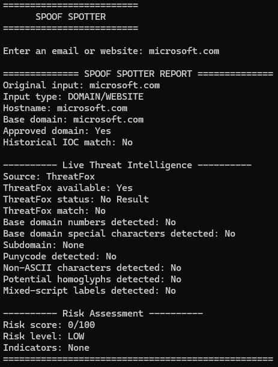
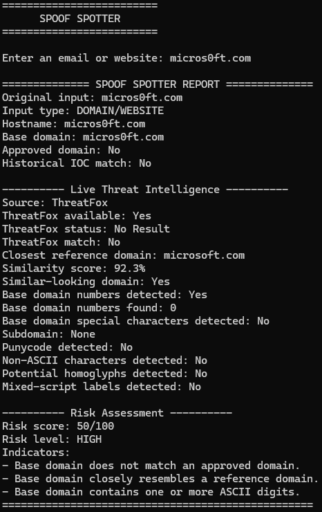
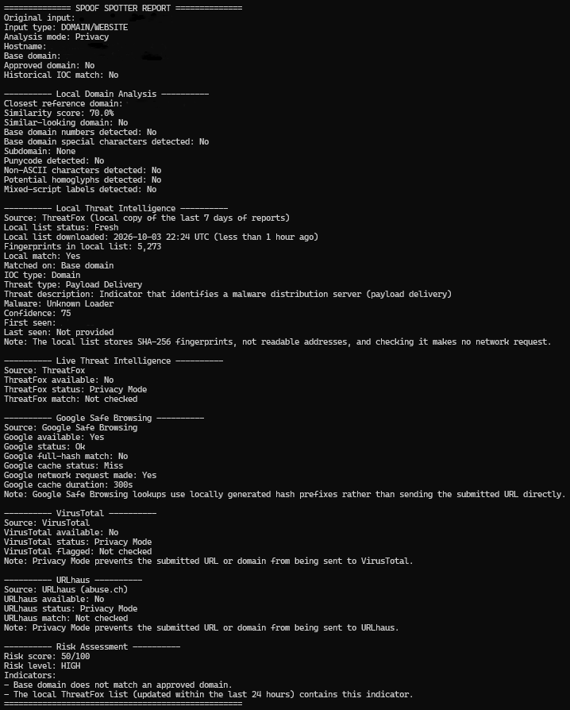

# Spoof Spotter

Spoof Spotter is a Python-based domain, URL, and email-domain analysis tool designed to identify indicators commonly associated with spoofing, phishing, and malicious domain activity.

The project combines local domain analysis, historical IOC correlation, privacy-aware live threat intelligence, and explainable heuristic risk scoring.

> **Important:** Spoof Spotter is an educational cybersecurity project. Risk scores represent weighted security indicators and are **not** probabilities that a domain is malicious.

---

## Getting Started

### 1. Clone the Repository

Clone or download the Spoof Spotter repository and open a terminal in the project directory.

### 2. Install Dependencies

```cmd
py -m pip install -r requirements.txt
```

### 3. Obtain and Configure API Credentials (Optional)

Spoof Spotter can store supported API credentials in the operating system credential vault through Python `keyring`. Credentials are optional. If a service is unavailable, not configured, blocked by the selected privacy policy, or otherwise cannot be reached, Spoof Spotter continues with the intelligence sources that remain available.

#### abuse.ch Auth-Key (ThreatFox and URLhaus)

ThreatFox and URLhaus are both run by abuse.ch and share one free, personal abuse.ch Auth-Key.

1. Open the [abuse.ch Authentication Portal](https://auth.abuse.ch/).
2. Sign in or create an abuse.ch account.
3. Create or copy your personal Auth-Key.
4. Do not paste the key into source code, screenshots, issues, or commits.
5. Store it with Spoof Spotter using the credential setup utility described below.

Official documentation:

- [ThreatFox Community API](https://threatfox.abuse.ch/api/)
- [URLhaus API](https://urlhaus-api.abuse.ch/)

#### Google Safe Browsing API Key

Spoof Spotter uses Google Safe Browsing v5 for privacy-conscious hash-prefix lookups.

1. Sign in to the [Google Cloud Console](https://console.cloud.google.com/).
2. Create a new Google Cloud project or select an existing project.
3. Open **APIs & Services > Library** and enable the **Safe Browsing API** for that project.
4. Open **APIs & Services > Credentials**.
5. Select **Create credentials > API key**.
6. Apply an API restriction so the key is limited to the Safe Browsing API when practical.
7. Copy the API key and store it with Spoof Spotter using the credential setup utility.
8. Do not commit or publish the key.

Google recommends restricting API keys and keeping them out of source code. Safe Browsing is intended for non-commercial use; Google directs commercial malicious-URL detection use cases to Web Risk.

Official documentation:

- [Google Cloud API key management](https://cloud.google.com/docs/authentication/api-keys)
- [Google Safe Browsing APIs](https://developers.google.com/safe-browsing/reference)

#### VirusTotal API Key

Spoof Spotter uses VirusTotal for phishing and URL reputation lookups. VirusTotal combines verdicts from dozens of security vendors, including vendors that specialize in phishing detection.

1. Create a free account at [VirusTotal](https://www.virustotal.com/gui/join-us).
2. Confirm your email address and sign in.
3. Open the menu under your username and select **API key**, or go directly to [your API key page](https://www.virustotal.com/gui/my-apikey).
4. Copy your personal API key.
5. Store it with Spoof Spotter using the credential setup utility.

The free public API allows 4 lookups per minute and 500 per day, and must not be used in commercial products or services. Spoof Spotter makes at most one VirusTotal lookup per analysis and only reads existing reports. It never submits a URL for a new scan.

Official documentation:

- [VirusTotal API v3 overview](https://docs.virustotal.com/reference/overview)
- [VirusTotal Public vs Premium API](https://docs.virustotal.com/reference/public-vs-premium-api)

#### Store Keys in the OS Credential Vault

After obtaining a supported key, run:

```cmd
py tools\configure_api_keys.py
```

Use the menu to store or update the credential for the appropriate service:

```text
ThreatFox / URLhaus (abuse.ch Auth-Key)
Google Safe Browsing
VirusTotal
```

The setup utility uses the operating system credential vault through Python `keyring`. The key is not intentionally written into the Spoof Spotter repository.

You can run the setup utility again to view credential **status** or remove a stored credential. Status output identifies whether a credential is coming from the OS keyring, an environment variable, or is missing without printing the secret itself.

#### Environment-Variable Alternative

Environment variables remain supported for development, CI, and automation and take priority over the OS keyring when present.

```text
THREATFOX_AUTH_KEY
GOOGLE_SAFE_BROWSING_API_KEY
VIRUSTOTAL_API_KEY
```

`THREATFOX_AUTH_KEY` holds the abuse.ch Auth-Key and is used for both ThreatFox and URLhaus.

Example temporary Windows CMD variables:

```cmd
set THREATFOX_AUTH_KEY=YOUR_AUTH_KEY
set GOOGLE_SAFE_BROWSING_API_KEY=YOUR_API_KEY
set VIRUSTOTAL_API_KEY=YOUR_API_KEY
```

Remove temporary values from the current CMD session when finished:

```cmd
set THREATFOX_AUTH_KEY=
set GOOGLE_SAFE_BROWSING_API_KEY=
set VIRUSTOTAL_API_KEY=
```

> **Credential safety:** Never hardcode real API keys in source code. Never commit API keys, `.env` files, credential exports, screenshots containing secrets, or other secret material to GitHub. Review `git diff` and `git diff --cached` before every public commit.

### 4. Download the Local Threat List (Optional)

```cmd
py tools\update_local_intel.py
```

This saves fingerprints of recent ThreatFox IOCs so inputs can also be checked offline and in Privacy Mode. It uses the same abuse.ch Auth-Key as ThreatFox and URLhaus. Run it again whenever the report says the local list is stale. See [Local Threat Intelligence (Offline)](#local-threat-intelligence-offline).

### 5. Run Spoof Spotter

```cmd
py spoof_spotter.py
```

Choose an analysis mode, then enter an email address, domain, or website when prompted.

### 6. Run the Automated Test Suite

```cmd
py -m unittest discover -s tests -v
```

The automated suite uses mocked responses for live-service behavior where appropriate. Unit tests should not require real API keys or intentionally contact live threat-intelligence services.

---

## Analysis Modes

Spoof Spotter separates local analysis from external intelligence requests.

### Standard Mode

Standard Mode can use:

- Local domain analysis
- Historical IOC intelligence
- Offline local ThreatFox list
- ThreatFox live IOC lookups
- Google Safe Browsing hash-prefix lookups
- VirusTotal URL and domain reputation lookups
- URLhaus malware-URL and host intelligence

### Privacy Mode

Privacy Mode minimizes disclosure to external services.

Privacy Mode:

- Keeps local analysis enabled
- Keeps historical/local intelligence enabled
- Keeps the offline local ThreatFox list enabled
- Keeps Google Safe Browsing hash-prefix lookups enabled
- Blocks cleartext ThreatFox lookups
- Blocks cleartext VirusTotal and URLhaus lookups

Privacy Mode is designed to reduce external disclosure. It should not be interpreted as anonymous browsing or complete network anonymity.

---

## Current Features

### Input Analysis

- Accepts domain names, websites, and email addresses
- Normalizes domain input
- Extracts base domains and subdomains
- Supports multi-level public suffixes
- Distinguishes full URLs from bare domains for URL-specific intelligence

### Domain Analysis

- Approved-domain checking using a separate explicit approved-domain list
- Similarity and typo-squatting detection against a legitimate reference corpus
- 10,000-domain Tranco reference dataset
- Separate approved-domain trust and reference-domain similarity roles
- Exact reference-domain matches are not treated as typo-squatting matches
- ASCII digit detection
- Domain and subdomain character analysis
- Unicode character detection
- Homoglyph detection
- Mixed-script detection
- Punycode detection and decoding

### Reference-Domain Intelligence

Spoof Spotter uses a local 10,000-domain subset of the Tranco research-oriented domain ranking as a reference corpus for similarity and typo-squatting analysis.

Reference domains are used only as comparison candidates. Inclusion in the Tranco reference corpus does **not** mean that a domain is approved, trusted, safe, or free from compromise.

The reference corpus is maintained separately from `approved_domains.txt` so that popularity or similarity data cannot automatically establish trust.

Spoof Spotter records the Tranco list source and version information in `data/reference_sources.txt` for provenance and reproducibility.

### Historical Threat Intelligence

Spoof Spotter supports historical IOC correlation using the FBI LabHost domain dataset.

Historical IOC matches are treated as strong indicators, but they do not by themselves establish that a domain is currently malicious.

### Local Threat Intelligence (Offline)

Spoof Spotter can keep a local copy of recent ThreatFox intelligence so that inputs can be checked without sending them anywhere.

```cmd
py tools\update_local_intel.py
```

The update tool downloads the IOCs that ThreatFox published in the last 7 days using your abuse.ch Auth-Key. Only domain and URL IOCs are kept, and each one is saved as a SHA-256 fingerprint rather than a readable address. The readable list is never written to disk, so the local file cannot be used as a list of malicious websites. Spoof Spotter can only answer whether a submitted input is on the list.

Local checks:

- Make no network request, so they run in both Standard and Privacy Mode and work offline
- Check the hostname, each parent domain down to the base domain, and full URLs
- Never flag a whole shared domain because one of its subdomains or URLs is listed

Freshness:

- **Fresh:** less than 24 hours old
- **Stale:** 24 hours to 7 days old. The list is still used, and the report recommends an update.
- **Expired:** 7 days or older. The list is not used until it is updated.

Every report shows the local list's status, download time, and number of fingerprints. A failed or empty download keeps the existing list instead of replacing it.

The downloaded list is stored in `data/local_intel/`, which is excluded from Git. Each user downloads their own copy with their own Auth-Key. Absence from the local list does not mean an input is safe.

abuse.ch provides free access for not-for-profit use. Commercial use may require a paid subscription through Spamhaus.

### Live Threat Intelligence

#### ThreatFox

Spoof Spotter integrates with the ThreatFox Community API by abuse.ch.

ThreatFox lookups can provide:

- Exact IOC matches
- IOC type
- Threat type
- Threat description
- Associated malware information
- Confidence level
- First-seen and last-seen timestamps
- Compromised-host status

ThreatFox intelligence is preserved as contextual evidence rather than being reduced to a simple malicious/clean result.

ThreatFox cleartext lookups are allowed in Standard Mode and blocked in Privacy Mode.

#### Google Safe Browsing

Spoof Spotter integrates with Google Safe Browsing v5 using locally generated URL hash expressions and 4-byte SHA-256 hash prefixes.

The submitted URL is canonicalized and hashed locally. Only generated hash prefixes are sent to Google. Returned full hashes are verified locally before a match is reported.

The integration includes:

- URL canonicalization
- Safe Browsing hash-expression generation
- 4-byte hash-prefix requests
- Binary protobuf response decoding
- Full-hash verification
- Positive and negative cache handling
- `cacheDuration` support
- Controlled live-test tooling

Google Safe Browsing remains available in both Standard and Privacy modes because the lookup path sends locally generated hash prefixes rather than the submitted URL directly.

#### VirusTotal

Spoof Spotter integrates with the VirusTotal API v3 for phishing and URL reputation intelligence.

- Full URLs are checked with a VirusTotal URL report lookup.
- Bare domains and email domains are checked with a VirusTotal domain report lookup.

VirusTotal lookups can provide:

- How many security vendors rated the URL or domain malicious, suspicious, harmless, or undetected
- Which vendors specifically reported phishing
- The date of the most recent analysis
- The VirusTotal community reputation score
- A link to the full VirusTotal report

Spoof Spotter only reads existing VirusTotal reports and never submits new scans. An indicator that VirusTotal has never analyzed is reported as not found, which does not mean it is safe.

Vendor verdicts can disagree, and a single detection may be a false positive, so results are shown with their vendor counts rather than reduced to a simple malicious/clean result.

VirusTotal lookups are allowed in Standard Mode and blocked in Privacy Mode because the submitted URL or domain is sent to VirusTotal.

#### URLhaus

Spoof Spotter integrates with URLhaus by abuse.ch, a database of URLs used to distribute malware.

- Full URLs are checked with a URLhaus URL lookup.
- Bare domains and email domains are checked with a URLhaus host lookup.

URLhaus lookups can provide:

- URL status (online, offline, or unknown)
- Threat type, such as malware download
- Tags describing the malware or campaign
- For hosts, how many malware URLs were recorded and how many are currently online
- Spamhaus DBL and SURBL blocklist status
- A link to the URLhaus reference page

URLhaus uses the same abuse.ch Auth-Key as ThreatFox. It focuses on malware distribution rather than phishing pages, and a listed host may be a legitimate site that was compromised.

URLhaus lookups are allowed in Standard Mode and blocked in Privacy Mode because the submitted URL or domain is sent to abuse.ch.

---

## Explainable Risk Scoring

Spoof Spotter generates a heuristic risk score from 0 to 100.

Current risk levels:

- **LOW:** 0-24
- **MODERATE:** 25-49
- **HIGH:** 50-74
- **CRITICAL:** 75-100

The score can incorporate weighted indicators such as:

- Unapproved domains
- Similarity to legitimate reference domains
- Suspicious character patterns
- Unicode and homoglyph indicators
- Historical IOC matches
- Live ThreatFox IOC matches
- ThreatFox confidence information
- Offline local ThreatFox list matches
- Google Safe Browsing verified full-hash threat matches
- VirusTotal malicious-vendor consensus
- VirusTotal suspicious-vendor and phishing-specific consensus
- URLhaus URL and host intelligence

VirusTotal findings contribute conservatively to the score based on the number and type of vendor detections. A single malicious verdict receives substantially less weight than broad vendor consensus.

URLhaus findings are weighted according to context. A currently online malware-distribution URL receives stronger weight than historical host-level intelligence.

Local ThreatFox list matches receive more weight when the list is fresh than when it is stale, and an expired list is not used. Because the local list is a copy of ThreatFox data, a local match is not counted again when the live ThreatFox lookup already matched. When the live lookup ran and found nothing for the base domain, the newer live result is used for that domain.

Harmless, undetected, unavailable, or not-found results do not subtract risk and should not be interpreted as proof of safety.

The score is intended to explain why an input was flagged. It is **not** a probability of malicious activity.

---

## Threat Intelligence Sources

Current and integrated intelligence sources include:

- **FBI / IC3 LabHost historical domain data**
- **ThreatFox by abuse.ch** (live lookups and an offline local list)
- **Google Safe Browsing v5**
- **VirusTotal**
- **URLhaus by abuse.ch**

Threat-intelligence matches should be interpreted with their source, confidence, freshness, status, and surrounding context.

A matched domain or URL may represent malicious infrastructure, or it may be an otherwise legitimate host that has been compromised.

---

## Screenshots

### Clean Domain Analysis in Standard Mode

A known legitimate domain provides a baseline example. `microsoft.com` matches the approved-domain list, and every intelligence source runs: the local ThreatFox list, live ThreatFox, Google Safe Browsing, VirusTotal, and URLhaus. None reports a match, and the risk score is 0 (LOW).



### Tranco Reference-Domain Similarity Detection

Spoof Spotter compares an unapproved domain against a 10,000-domain Tranco reference corpus. In this example, the altered domain is matched to `microsoft.com` with a 92.3% similarity score. Together with the digit substitution and broad VirusTotal vendor consensus, including phishing-specific verdicts, this raises the risk score to 90 (CRITICAL).



### Offline IOC Detection in Privacy Mode

Privacy Mode blocks live ThreatFox, VirusTotal, and URLhaus lookups so the submitted domain is not sent to those services. Google Safe Browsing still runs because it receives only hash prefixes. The offline local ThreatFox list still identifies the domain as a known malware-distribution indicator, entirely on the local computer, and the risk score is 50 (HIGH).



> The IOC example is shown for defensive analysis only. Potentially active IOC values and identifying timestamps have been redacted.

## Project Structure

```text
spoof_spotter/
├── spoof_spotter.py
├── core/
│   ├── parser.py
│   ├── domain_checker.py
│   ├── reference_domains.py
│   ├── similarity.py
│   ├── tranco_importer.py
│   ├── character_checker.py
│   ├── risk.py
│   ├── report.py
│   ├── threat_intel.py
│   ├── threatfox.py
│   ├── privacy.py
│   ├── credentials.py
│   ├── google_safe_browsing.py
│   ├── google_safe_browsing_client.py
│   ├── google_safe_browsing_cache.py
│   ├── google_safe_browsing_protobuf.py
│   ├── virustotal.py
│   ├── urlhaus.py
│   └── local_intel.py
├── data/
│   ├── approved_domains.txt
│   ├── reference_domains.txt
│   ├── reference_sources.txt
│   ├── historical_iocs/
│   │   ├── LabHost_Domains.csv
│   │   └── sources.txt
│   └── local_intel/            (downloaded, excluded from Git)
├── docs/
│   └── screenshots/
│       ├── microsoft-clean.png
│       ├── tranco-similarity.png
│       └── positive-redacted.png
├── tests/
│   ├── test_parser.py
│   ├── test_domain_checker.py
│   ├── test_reference_domains.py
│   ├── test_similarity.py
│   ├── test_tranco_importer.py
│   ├── test_character_checker.py
│   ├── test_risk.py
│   ├── test_report.py
│   ├── test_threat_intel.py
│   ├── test_threatfox.py
│   ├── test_privacy.py
│   ├── test_credentials.py
│   ├── test_google_safe_browsing.py
│   ├── test_google_safe_browsing_cache.py
│   ├── test_google_safe_browsing_client.py
│   ├── test_google_safe_browsing_protobuf.py
│   ├── test_virustotal.py
│   ├── test_urlhaus.py
│   └── test_local_intel.py
├── tools/
│   ├── benchmark_similarity.py
│   ├── update_reference_domains.py
│   ├── configure_api_keys.py
│   ├── manual_google_safe_browsing_live.py
│   ├── manual_virustotal_urlhaus_live.py
│   └── update_local_intel.py
├── requirements.txt
├── README.md
└── LICENSE
```

---

## Similarity Performance

Spoof Spotter currently compares input domains against a local 10,000-domain reference corpus.

During development, the similarity workflow originally performed two complete reference-corpus comparisons for each analysis. The workflow was refactored to calculate the closest-domain similarity once and reuse the resulting score for threshold evaluation.

Local benchmark results:

- Reference domains: 10,000
- Before optimization: approximately 0.380 seconds
- After optimization: approximately 0.191 seconds
- Benchmark reduction: approximately 50%

Benchmark results are system-dependent and are included as development measurements rather than guaranteed performance.

---

## Security and Credential Handling

Spoof Spotter does not require API credentials to be stored in the repository.

API credentials can be stored through the operating system credential vault using Python `keyring`:

```cmd
py tools\configure_api_keys.py
```

Environment variables remain supported as an override for development and automation.

Security requirements:

- Never hardcode real API credentials in source code.
- Never commit API keys, `.env` files, secret files, or credential exports.
- Each user should obtain and use their own service credentials.
- Credentials should never be printed in reports or diagnostic output.
- Live-intelligence integrations should fail gracefully when credentials or network access are unavailable.
- Privacy Mode should block services that require disclosure of cleartext indicators where appropriate.
- Potentially active malicious URLs should not be opened solely for testing.
- Live-IOC screenshots should redact active infrastructure or identifying values when appropriate.
- Downloaded threat intelligence is stored only as SHA-256 fingerprints and is never committed to the repository.

Before committing changes, review both the working tree and staged diff for accidentally exposed secrets.

---

## Release Roadmap

Spoof Spotter is approaching feature completion. VirusTotal and URLhaus complete the live threat-intelligence integrations, and the offline local ThreatFox list completes the local intelligence path planned for the initial release.

Remaining planned work:

- Validate the local ThreatFox list against live lookups over time.
- Finalize CLI/report formatting and documentation.
- Perform a final security, credential, and repository review.
- Tag a stable initial release.

Additional live APIs are intentionally out of scope for the initial release unless a clear security or coverage gap is discovered.

---

## Project Status

Spoof Spotter is approaching feature completion.

The current implementation includes local spoofing analysis, separate approved and reference-domain architectures, a 10,000-domain Tranco similarity corpus, historical FBI/IC3 IOC correlation, live ThreatFox intelligence, Google Safe Browsing v5 privacy-conscious hash-prefix lookups, Standard and Privacy analysis modes, OS-keyring credential storage, VirusTotal URL and domain reputation lookups, URLhaus malware-URL lookups, an offline local ThreatFox list with freshness tracking, explainable heuristic risk scoring, performance benchmarking, and automated testing.

Remaining development is focused primarily on validation, documentation, testing, and release polish rather than additional intelligence sources.

---

## License

Spoof Spotter source code is licensed under the MIT License.

Third-party datasets and threat-intelligence data, including Tranco, FBI/IC3, abuse.ch (ThreatFox and URLhaus), Google Safe Browsing, and VirusTotal data, remain subject to the terms, notices, licenses, and usage conditions of their respective sources.
